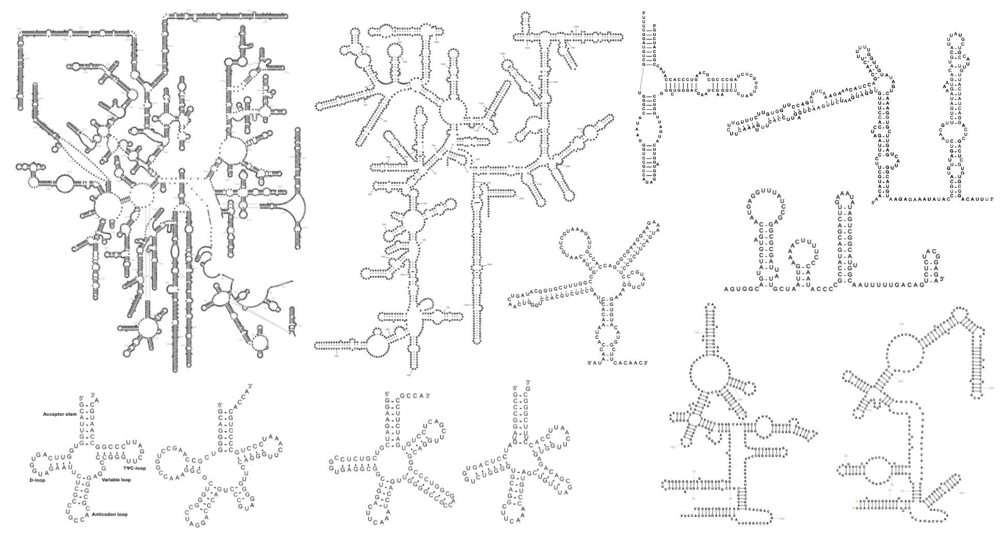

# R2DT

_Visualise RNA 2D structure in standard layouts_

**Version 1.3 (October 2022)**

The R2DT software (RNA 2D Templates) automatically generates [RNA secondary structure](https://en.wikipedia.org/wiki/Nucleic_acid_secondary_structure) diagrams in standard layouts using a template library representing a wide range of RNAs:

 - 5S and SSU rRNA from [CRW](http://www.rna.ccbb.utexas.edu)
 - 3D-structure based SSU and LSU rRNA from [RiboVision](http://apollo.chemistry.gatech.edu/RiboVision/#)
 - tRNA from [GtRNAdb](http://gtrnadb.ucsc.edu)
 - RNAse P from [Ribonuclease P Database](https://academic.oup.com/nar/article/26/1/351/2379438)
 - RNA families from [Rfam](https://rfam.org) (release 14.8)


R2DT is used by RNAcentral to visualise [>20 million RNA secondary structures](https://rnacentral.org/search?q=has_secondary_structure:%22True%22), and it is also used by [Rfam](https://rfam.org/search#tabview=tab1), [PDBe](https://www.ebi.ac.uk/pdbe/entry/pdb/1s72/RNA/1), [FlyBase](http://flybase.org/reports/FBgn0053537#gene_model_products), [SGD](https://www.yeastgenome.org/locus/S000006550/sequence), and other resources. See [method overview](#method-overview) for details or read the [R2DT paper](https://www.nature.com/articles/s41467-021-23555-5) in Nature Communications.

## Examples

The following example visualisations show LSU, SSU, and 5S rRNA, four tRNAs, two RNAse P, snoRNA, MoCo riboswitch, and U4 snRNA.



## Getting started

R2DT can be used in a number of ways:

* [Web application](https://rnacentral.org/r2dt) hosted by RNAcentral
* [API](https://www.ebi.ac.uk/Tools/common/tools/help/index.html?tool=r2dt) powered by EMBL-EBI Web Services
* As a command line tool with [Docker](https://www.docker.com), [Singularity](https://sylabs.io/docs/#singularity), or in a bare metal installation

## How to add new templates

If you would like to submit a new template or replace an existing one, please [submit an issue](https://github.com/RNAcentral/R2DT/issues/new) including:

- A FASTA or BPSEQ file with a reference sequence and secondary structure - see [FASTA](./data/rfam/RF00002/RF00002-traveler.fasta) and [BPSEQ](./data/ribovision-ssu/bpseq/EC_SSU_3D.bpseq) examples
- A [Traveler XML file](https://github.com/davidhoksza/traveler#traveler-intermediate-format) - see [example](./data/rfam/RF00002/traveler-template.xml)
- Description of the new template and any relevant background information

One can create a new template locally using the [generate_cm_library.py](./utils/generate_cm_library.py) script with the FASTA and XML files described above. It is also possible to generate a new template using a special version of the XRNA software, [XRNA-GT](https://github.com/LDWLab/XRNA-GT).

:warning: GitHub currently does not support attaching files with `.fasta` or `.bpseq` extensions so please attach the files as `.txt`.

We will review the template and reply on GitHub as soon as possible.

### Manually creating templates

1. Place new FASTA or BPSEQ file(s) in the `data/new` folder
1. Run `r2dt.py generatecm`. The command will generate new `.cm` file(s) with the covariance models
1. Move the new `.cm` and `.tr` files in the destination directory (for example, `ribovision-ssu` is where all SSU templates submitted by the RiboVision group are stored)
1. Run `r2dt.py generatemodelinfo <destination>/cms` to add new models to the list of searched models where `<destination>` is the same folder as in the step above
1. Update `metadata.tsv` file in the destination directory
1. Run `r2dt.py list-models` to update a list of all available models
1. Verify that the templates work as expected by testing on a fasta file with a sequence similar to the template
1. Run tests and update the model counts in `TestCovarianceModelDatabase` as needed

### Updating Rfam library

The following procedure should be done after each Rfam release:

1. Recompute all Rfam templates (takes ~6h)
    ```
    r2dt.py setup-rfam
    ```

1. Run tests

1. Generate new precomputed library archive
    ```
    tar -czvf cms.tar.gz <path/to/new/cms>
    ```

    The folder should contain 2 subfolders: `crw` and `rfam`.

1. Update the precomputed library link in Readme

1. Update a list of available models
    ```
    r2dt.py list-models
    ```

1. :warning: Note that the [tRNA Rfam Traveler template](./data/rfam/RF00005/traveler-template.xml) has been manually edited to match the standard tRNA layout so the automatically generated `traveler-template.xml` file should be discarded and the current version should be kept.

## Method overview

The R2DT pipeline includes the following steps:

1. **Generate a library of covariance models** using BPSEQ files from [CRW](http://www.rna.icmb.utexas.edu/DAT/3C/Structure/index.php), RiboVision or another source with [Infernal](http://eddylab.org/infernal/). For best results, remove pseudoknots from the secondary structures using [RemovePseudoknots](https://rna.urmc.rochester.edu/Text/RemovePseudoknots.html) from the RNAStructure package.
1. **Select the best matching covariance model** for each input sequence
using [Ribovore](https://github.com/nawrockie/ribovore) or [tRNAScan-SE 2.0](http://lowelab.ucsc.edu/tRNAscan-SE/).
1. **Fold** input sequence into a secondary structure compatible with the template
using the top scoring covariance model.
1. **Generate secondary structure diagrams** using [Traveler](https://github.com/davidhoksza/traveler) and the secondary structure layouts.

See the [R2DT paper](https://www.nature.com/articles/s41467-021-23555-5) for more details.

## Release process

All R2DT releases are [available](https://github.com/RNAcentral/R2DT/releases) on GitHub. R2DT uses [git flow](https://github.com/RNAcentral/R2DT/wiki) for managing the release process.

## Contributors

- [David Hoksza](https://github.com/davidhoksza) (Traveler software)
- [Eric Nawrocki](https://github.com/nawrockie) (Ribovore and Infernal software)
- [Anton S. Petrov](https://cool.gatech.edu/people/petrov-anton), [Loren D. Williams](https://cool.gatech.edu/people/williams-loren-dean), Holly McCann, Caeden Mead, and the [RiboVision](http://apollo.chemistry.gatech.edu/RiboVision/#) team
- [Todd Lowe](https://users.soe.ucsc.edu/~lowe/) and [Patricia Chan](https://www.soe.ucsc.edu/people/pchan) from [GtRNAdb](http://gtrnadb.ucsc.edu)
- [Robin Gutell](https://scholar.google.com/citations?user=IdDGv6oAAAAJ&hl=en) and [Jamie Cannone](https://scholar.google.com/citations?user=PnqrMGAAAAAJ&hl=en) (CRW)
- [Blake Sweeney](https://www.ebi.ac.uk/about/people/blake-sweeney), [Carlos Ribas](https://www.ebi.ac.uk/about/people/carlos-eduardo-ribas), [Fabio Madeira](https://www.ebi.ac.uk/about/people/fabio-madeira), [Rob Finn](https://www.ebi.ac.uk/about/people/rob-finn)
- [Anton I. Petrov](https://antonpetrov.com)

:wave: We welcome additional contributions so please feel free to [raise an issue](https://github.com/RNAcentral/R2DT/issues) or submit a pull request.

## Acknowledgements

- [Sean Eddy](http://eddylab.org) - [Infernal software](http://eddylab.org/infernal)
- [David Mathews](http://rna.urmc.rochester.edu/RNAstructure.html) - [RNAstructure software](http://rna.urmc.rochester.edu/RNAstructure.html)
- [Elena Rivas](http://rivaslab.org/) - [R-scape software](http://eddylab.org/R-scape/)
- [Zasha Weinberg](https://zashaweinberglab.org) - [R2R software](https://bmcbioinformatics.biomedcentral.com/articles/10.1186/1471-2105-12-3)
- [Vienna RNA team](https://www.tbi.univie.ac.at/RNA/) - RNAfold software
