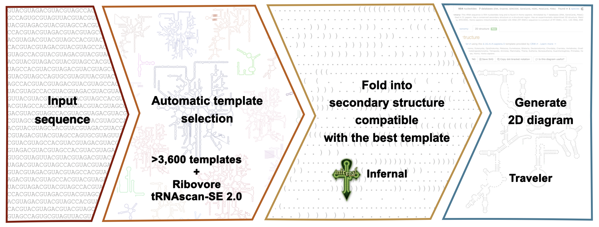

# Method overview

R2DT (which stands for RNA 2D Templates) is a software package that visualises RNA secondary structure in standard layouts representing a wide range of RNAs:

 * 3D-structure based SSU and LSU rRNA from [RiboVision](http://apollo.chemistry.gatech.edu/RiboVision/)
 * 5S and SSU rRNA from [CRW](http://www.rna.ccbb.utexas.edu)
 * tRNA from [GtRNAdb](http://gtrnadb.ucsc.edu)
 * RNAse P from [Ribonuclease P Database](https://www.ncbi.nlm.nih.gov/pmc/articles/PMC148169/)
 * RNA families from [Rfam](https://rfam.org)

## Pipeline

The R2DT pipeline includes the following steps:

1. **Generate a library of covariance models** using BPSEQ files from [CRW](https://crw-site.chemistry.gatech.edu/DAT/3C/Structure/index.php), RiboVision or another source with [Infernal](http://eddylab.org/infernal/). For best results, remove pseudoknots from the secondary structures using [RemovePseudoknots](https://rna.urmc.rochester.edu/Text/RemovePseudoknots.html) from the RNAStructure package.

2. **Select the best matching covariance model** for each input sequence
using [Ribovore](https://github.com/ncbi/ribovore) or [tRNAScan-SE 2.0](http://lowelab.ucsc.edu/tRNAscan-SE/).

1. **Fold** input sequence into a secondary structure compatible with the template
using the top scoring covariance model.

1. **Generate secondary structure diagrams** using [Traveler](https://github.com/cusbg/traveler) and the secondary structure layouts.

For a detailed method description see the [R2DT paper](https://www.nature.com/articles/s41467-021-23555-5).
