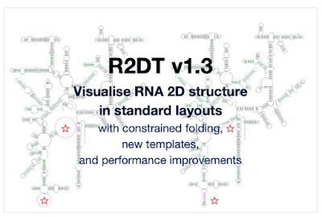
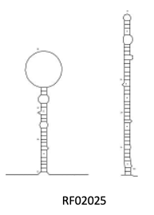
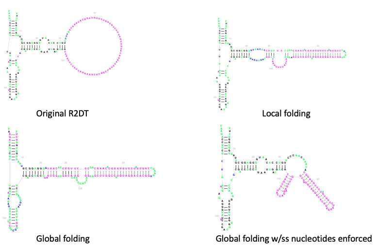
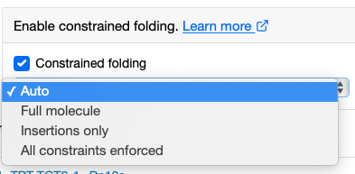

# R2DT Version 1.3

We are pleased to announce the release of [R2DT](http://rnacentral.org/r2dt) version 1.3 that introduces constrained folding functionality as well as new and updated templates. Read on to find out more or head to [GitHub](https://github.com/RNAcentral/R2DT) or the RNAcentral [web app](http://rnacentral.org/r2dt) to start using the new software.

## Constrained folding

R2DT uses templates for predicting and visualising RNA secondary structures. This [works well](https://www.nature.com/articles/s41467-021-23555-5) for the majority of sequences in RNAcentral. However, some sequences include large insertions that do not align to the templates. Previous versions of R2DT displayed such regions as unfolded loops.

For example, constrained folding improves species-specific insertions found in many rRNAs:

The new mode can also generate better diagrams where the Rfam consensus structure has long dangling ends or large hairpin loops:

In order to add base pairs for the unfolded regions that are not modelled by the templates, R2DT uses [RNAfold](http://rna.tbi.univie.ac.at/cgi-bin/RNAWebSuite/RNAfold.cgi) from the [Vienna RNA package](https://www.tbi.univie.ac.at/RNA/). There are four ways of using constrained folding:

- **Local folding**: the secondary structure of the insertion relative to the template is predicted with RNAfold and added to the diagram;
- **Global folding**: the entire molecule is folded using RNAfold with the template structure provided as a constraint;
- **Global folding with single-stranded nucleotides enforced**: same as above except for the nucleotides that align to single-stranded regions of the template are kept unpaired when predicting the new structure using RNAfold.

To use constrained folding include the `--constraint` option on the command line or choose one of the modes in the advanced options of the [web app](http://rnacentral.org/r2dt). The folding mode is automatically selected based on molecule type but can be manually overridden with `–fold_type` parameter or using a dropdown:

Special thanks to [Holly McCann](https://www.linkedin.com/in/holly-mccann-01963b169/) and [Anton S. Petrov](https://cool.gatech.edu/people/petrov-anton) (Georgia Tech) for developing this feature! 👏👏👏

## Other updates

- The R2DT library now includes the latest RNA families from the Rfam [release 14.8](https://xfam.wordpress.com/2022/05/30/rfam-release-14-8/), a manually curated template for HCV IRES, and updated rRNA templates for tomato (*Solanum lycopersicum*).
- A new `--skip_ribovore_filters` command line option has been added to generate diagrams for sequences that align to the templates with a large number of insertions ([learn more](https://github.com/RNAcentral/R2DT/issues/75)).
- [Traveler](https://www.ncbi.nlm.nih.gov/pmc/articles/PMC5688744/) software has been updated to v3.0.0.
- R2DT now generates output in JSON format using the [RNA2D-data-schema](https://github.com/LDWLab/RNA2D-data-schema).
- See the GitHub [pull request](https://github.com/RNAcentral/R2DT/pull/71) for further details on these and other changes.

## Summary

The new software is now available everywhere where you can find R2DT: on [GitHub](https://github.com/rnacentral/r2dt), [Docker Hub](https://hub.docker.com/r/rnacentral/r2dt), RNAcentral [web app](http://rnacentral.org/r2dt), and the [API](https://www.ebi.ac.uk/Tools/common/tools/help/index.html?tool=r2dt). Work is underway to regenerate the secondary structures displayed in RNAcentral using the new version of R2DT. Stay tuned for future releases and feel free to let us know if you have any feedback by raising an [issue](https://github.com/RNAcentral/R2DT/issues) or using the [contact us](https://rnacentral.org/contact) form.

This post originally appeared on the [RNAcentral blog](https://blog.rnacentral.org/2022/10/r2dt-version-13.html) on October 27th, 2022.
